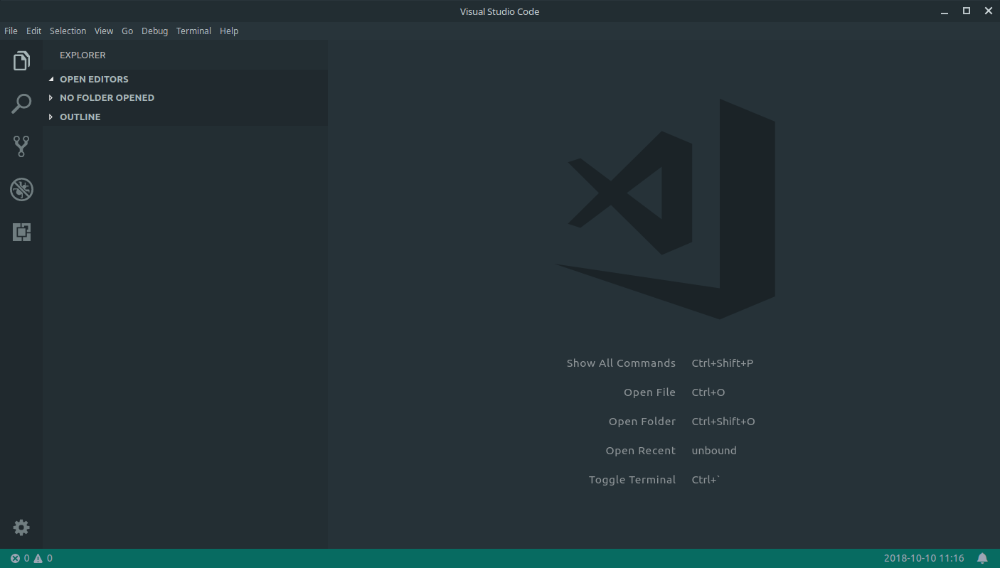
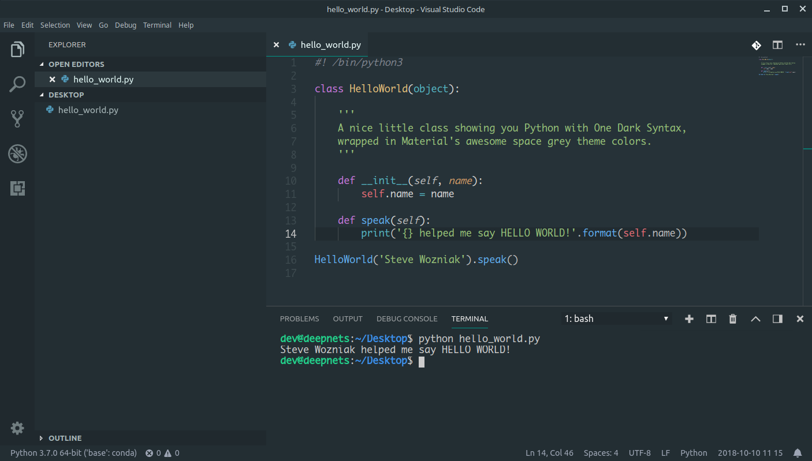

# one-material-dark+

Two themes for you to enjoy! A dark theme incorporating Material's space grey environment with One Dark syntax from Atom.io - now also including a hoth style light theme. See screen shots for examples in different states. Leave comments on repo if your favorite language's syntax looks terrible and I'll get a fix into my next update.

https://github.com/reka18/one-material-theme

Open editor with no open folders. Status bar default's to a cool teal.

Opening a folder sets the status bar color to match the rest of the editor to reduce distractions. One Dark syntax is great, especially with Python.

Fairly standard One Dark syntax for JSON formatted files.

